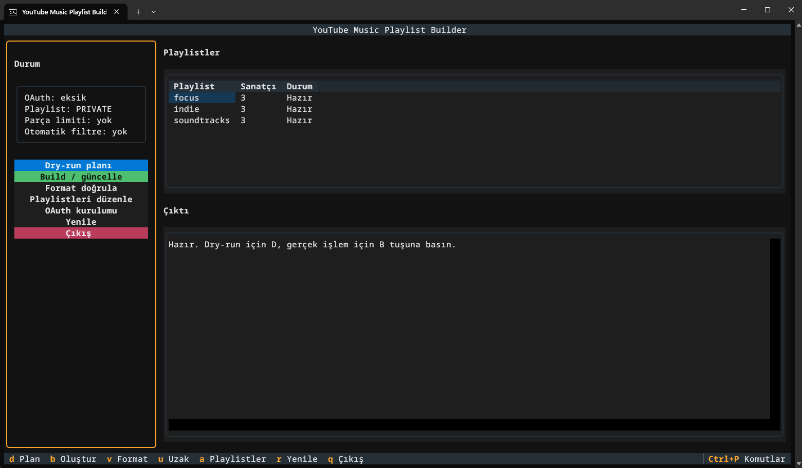

# YouTube Music Playlist Builder

A personal automation tool that builds organized RAW YouTube Music playlists from artist lists.

The builder collects album and single catalogs, removes duplicate entries, and creates playlists for manual cleanup in YouTube Music. It does not download music to a phone, automatically filter live/remix/remaster versions, or split playlists by track count.

## Workflow

```text
Add artists
  → Collect album and single catalogs
  → Remove duplicates
  → Build a RAW playlist
  → Review and clean up in YouTube Music
  → Download through the YouTube Music app
```

Each `.txt` file in `artists/` represents one playlist target.

## Requirements

- Python 3.13 or newer
- A Google OAuth desktop client
- A YouTube Music account
- Windows PowerShell for the documented commands

## Installation

```powershell
python -m venv .venv
.\.venv\Scripts\python.exe -m pip install -r requirements.txt
Copy-Item config.example.yaml config.yaml
```

Create a Google OAuth desktop client and save the downloaded JSON file as:

```text
auth/client_secret.json
```

Then create the local OAuth token:

```powershell
.\.venv\Scripts\python.exe build_playlists.py --setup-oauth
```

The token is stored locally at:

```text
auth/oauth.json
```

Never commit or share files from `auth/`. The directory is excluded by `.gitignore`.

## Artist Files

Artist lists are stored as local text files under `artists/`. These `.txt` files are intentionally ignored by Git so personal lists are not committed accidentally. See [`artists/README.md`](artists/README.md) for the local file format.

Supported formats:

```text
Radiohead
https://music.youtube.com/@radiohead
Radiohead | https://music.youtube.com/channel/UCq19-LqvG35A-30oyAiPiqA
```

A plain name is resolved through YouTube Music. A channel URL is used directly. In the `name | URL` format, the URL is authoritative while the name is used as the display label.

The filename becomes the playlist name:

```text
artists/METAL - RAW.txt
```

## Recommended Workflow

Validate local formatting first:

```powershell
.\.venv\Scripts\python.exe build_playlists.py --validate-format
```

This check does not use the network. Any file changes require confirmation.

Preview the remote build plan:

```powershell
.\.venv\Scripts\python.exe build_playlists.py --dry-run
```

`--dry-run` does not create or update playlists, but it may resolve artists and collect catalog data through the YouTube Music API. OAuth and network access are therefore required.

Optionally validate artist resolution and remote duplicates:

```powershell
.\.venv\Scripts\python.exe build_playlists.py --validate-remote
```

This command uses the YouTube Music API and asks for confirmation before changing artist files.

Build or update the playlists:

```powershell
.\.venv\Scripts\python.exe build_playlists.py
```

## Terminal Interface

Start the interactive interface with:

```powershell
.\.venv\Scripts\python.exe build_playlists.py --tui
```



You can also double-click `run.bat` on Windows.

Main shortcuts:

| Key | Action |
| --- | --- |
| `D` | Show the current plan |
| `B` | Build or update playlists |
| `V` | Validate local artist files |
| `U` | Validate artists remotely |
| `A` | Open the playlist editor |
| `R` | Reload data |
| `Q` | Quit |
| `Ctrl+P` | Open the command palette |

The playlist editor also supports creating, renaming, editing, deleting, and saving artist lists.

## Playlist Behavior

The default configuration uses private playlists and `append_only` updates.

The builder can be run repeatedly. Local state is stored in:

```text
state/build_state.json
```

The state file tracks playlist IDs, generated tracks, manually removed tracks, and artist aliases. In `append_only` mode, tracks manually removed from YouTube Music are not automatically added again.

Build events are written to:

```text
logs/build.jsonl
```

These files are local runtime data and are excluded from version control.

## Project Layout

```text
artists/       Artist lists and playlist targets
src/           Application code
tests/         Automated tests
state/         Local build state
cache/         Temporary cache data
logs/          Build logs
docs/          Additional project documentation
```

## Testing

Install the development and test dependencies:

```powershell
.\.venv\Scripts\python.exe -m pip install -r requirements-dev.txt
```

Run the test suite:

```powershell
.\.venv\Scripts\python.exe -m pytest --basetemp=work/pytest-tmp
```

## Configuration Notes

The current configuration uses:

```yaml
playlist:
  privacy: PRIVATE
  update_mode: append_only
```

The old `playlist.max_tracks` setting is no longer used and can be removed from older configuration files.

## Development Note

This project was human-directed and developed with substantial AI coding assistance. Product direction, design decisions, code review, and release preparation were led by me.
